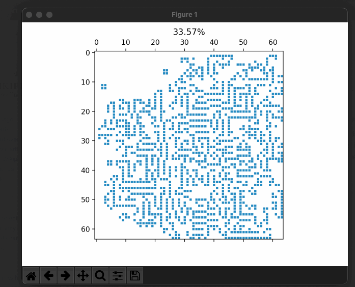

## Game of life

####Очередная иплементация [Conway's Game of Life](https://en.wikipedia.org/wiki/Conway%27s_Game_of_Life)



Ее основные правила:

* Любая живая клетка с 2-мя или 3-мя соседями остается живой
* Любая мертвая клетка с 3-мя соседями становится живой
* Все прочие клетки, живые или мертвые, становятся/остаются мертвыми

#### Использование
```
usage: gol.py [-h] [-f FIELD_SIZE] [-l LIFE_PROC] [-t TIME] [-s SEED]

Conway's Game of Life yet another implementation

optional arguments:
  -h, --help            show this help message and exit
  -f FIELD_SIZE, --field-size FIELD_SIZE
                        Field size in cells. You need to specify just one side, since it's square anyway... Default is 128x128
  -l LIFE_PROC, --life-proc LIFE_PROC
                        Percent of alive cells. Default value is 5
  -t TIME, --time TIME  Pause between ticks in milliseconds. Default value is 40
  -s SEED, --seed SEED  Seed for random number generator. Default value is None, for random start every time
```

Зависимости:  

* numpy - для удобной работы с матрицами
* matplotlib - для отрисовки